# Evidence Candidate Map

공개 Slack 최근 2년 증적을 기준으로, 어떤 프로젝트가 독립 폴더로 분리 가능한지 빠르게 판단하기 위한 후보맵이다. 이 문서는 채널, 첨부파일, 증적 유형을 함께 보고 수집 우선순위를 정하는 용도로 사용한다.

## 목적

- 공개 Slack 전체에서 프로젝트 후보를 빠르게 식별한다.
- 후보별로 어떤 증적이 이미 확보되었는지 한눈에 확인한다.
- 다음 수집 액션을 프로젝트별로 분리해서 운영한다.
- 공통 채널과 프로젝트 채널의 역할을 분리한다.

## Candidate Map

```mermaid
graph TD
    A["Public Slack Evidence (2024-04-21 ~ 2026-04-21)"]

    A --> B["확정 / 고밀도"]
    A --> C["보조 채널 / 하위 workstream 후보"]
    A --> D["2차 탐색 후보"]
    A --> E["공통 보조 채널"]

    B --> B1["PSK / PSKH"]
    B --> B2["서울세미콘 / SSC Vina"]
    B --> B3["금호타이어 첫제품 X-ray"]
    B --> B4["현대모비스"]
    B --> B5["메카로 수요예측"]
    B --> B6["화승 AI바우처"]
    B --> B7["한국알박"]
    B --> B8["LG엔솔 이미지분석"]
    B --> B9["서울바이오시스"]
    B --> B10["금호타이어 CMS"]
    B --> B11["Advanced Electric Korea"]
    B --> B12["Daeduck AFVI"]
    B --> B13["대한전선 공정혁신과제"]
    B --> B14["BGF에코스페셜티(구 FLK)"]
    B --> B15["나노텍 정출연과제"]
    B --> B16["ZEUS AI바우처"]
    B --> B17["픽셀 AI바우처"]

    C --> C1["DMT"]

    D --> D1["PSK 온도예측task"]
    D --> D2["한맥-pjt"]

    E --> E1["#tf_cross_team_sales"]
    E --> E2["#sales_team"]
    E --> E3["#0_rtm_general"]
    E --> E4["#tsi_unit"]

    B1 --> B1F["회의록 / 견적 / 계약 / KPI / 공수 / 로드맵 / 발주"]
    B2 --> B2F["NDA / 계약서 / PO / Invoice / Acceptance Report"]
    B3 --> B3F["경과보고 / 사용자매뉴얼 / 산출물 / 현장회의 / 납품 일정"]
    B4 --> B4F["요구사항 확인 / 제작사양 / 견적 수정 / 납기 충돌"]
    B5 --> B5F["Pre-PoC 리뷰 / PoC 결과발표 / 단계별 제안서 / FCST 근거자료"]
    B6 --> B6F["사업계획서 / 검수확인서 / 최종평가 / 기능추가 견적 / 수량 정정"]
    B7 --> B7F["데모 추진계획 / 최종리뷰 / 견적서 / PoC 제안서 v2"]
    B8 --> B8F["과제 범위 / XRM 샘플 / 인프라 요구 / 자료 경로"]
    B9 --> B9F["EHM 소개 / 데모 POC 결과 / 2차 결과보고 / AI agent 인사이트"]
    B10 --> B10F["result.zip / raw-overlay / 배포 테스트"]
    B11 --> B11F["세금계산서 / 하자이행보증증권 / recipes.zip"]
    B12 --> B12F["AFVI 제안서 / ODB feature / 구성도"]
    B13 --> B13F["Daily csv / 불량이미지 zip / user guide"]
    B14 --> B14F["운영 리뷰 / 장애처리보고 / 성능 이슈"]
    B15 --> B15F["OES 활용사례 / 협업Item / 과제서류"]
    B16 --> B16F["중간보고 / 사업계획서 / 결과보고 / 협업 제안"]
    B17 --> B17F["중간보고 / 협력모델안 / 판정기준 / 도메인 정의"]
```

## 후보별 판정 요약

| 후보 | 대표 채널 | 대표 첨부파일 | 증적 판단 |
| --- | --- | --- | --- |
| PSK / PSKH | `#tf_psk-업무대응`, `#pjt_psk_pe-agent`, `#pjt_psk_precia`, `#psk-견적발주납품현황` | `PSK MI-RTM 주간회의록`, `PE Agent 질문 리스트_허정회신.xlsx`, `공수 산정.xlsx`, `Roadmap.pdf` | 독립 폴더 확정 |
| 서울세미콘 / SSC Vina | `#hubble-pjt-seoulsemicon`, `#tf_seoulsemicon-vina` | `NDA`, `계약서`, `PO`, `Invoice`, `Acceptance Report` | 독립 폴더 확정 |
| 금호타이어 첫제품 X-ray | `#pjt_금호타이어_첫제품x-ray` | `경과보고.pptx`, `사용자 매뉴얼.pdf`, `산출물.xlsx` | 독립 폴더 확정 |
| 현대모비스 | `#pjt_현대모비스` | `요구사항 확인`, `제작사양서.xlsx`, `견적서.pdf` | 독립 폴더 확정 |
| 화승 AI바우처 | `#pjt_화승_ai바우처` | `기능추가개발 견적서.pdf`, `검수확인서.pdf` | 독립 폴더 확정 |
| LG엔솔 이미지분석 | `#pjt_lg엔솔이미지분석` | XRM/Li 과제 범위 및 인프라 요구사항 메시지 | 독립 폴더 확정 |
| 메카로 수요예측 | `#pjt_메카로-수요예측` | `단계별 프로젝트 수행 제안서.pdf`, `PoC 결과발표.pptx` | 독립 폴더 확정 |
| 한국알박 | `#pjt_한국알박` | `PoC 제안서.pdf`, `견적서.pdf`, `최종리뷰 gdoc` | 독립 폴더 확정 |
| 서울바이오시스 | `#pjt_서울바이오시스` | `EHM 소개 및 데모 POC 결과 공유.pdf`, `POC 2차 결과 보고.pdf`, `AIagent 통합 인사이트.pptx` | 독립 폴더 확정 |
| 금호타이어 CMS | `#pjt_금호타이어_cms` | `result.zip`, `*_raw.png`, `*_overlay.png` | 독립 폴더 확정 |
| Advanced Electric Korea | `#hubble-pjt-어드벤스일렉트릭코리아` | 세금계산서, 하자이행보증증권, `recipes.zip`, 개선요청사항.xlsx | 독립 폴더 확정 |
| Daeduck AFVI | `#hubble-pjt-대덕전자_afvi` | AFVI 제안서, ODB feature 파일, 네트워크 구성도 | 독립 폴더 확정 |
| 대한전선 공정혁신과제 | `#pjt-대한전선-공정혁신과제-호반혁신기술공모전` | Daily csv, 불량이미지.zip, `ADV user guide.pdf` | 독립 폴더 확정 |
| BGF에코스페셜티(구 FLK) | `#pjt-비지에프에코스페셜티-구-flk` | 운영 리뷰 ppt/pdf, 장애처리보고서.xlsx | 독립 폴더 확정 |
| 나노텍 정출연과제 | `#pjt_나노텍_정출연과제` | OES 활용사례, 협업Item, 초회미팅.docx | 독립 폴더 확정 |
| 픽셀 AI바우처 | `#pjt_픽셀_ai바우처` | 중간보고, 협력모델안, 판정기준 정리 | 독립 폴더 확정 |
| ZEUS AI바우처 | `#pjt_zeus_ai바우처` | 사업계획서, 중간보고, 결과보고, 협업 제안 | 독립 폴더 확정 |
| DMT | `#pjt_dmt` | 배포 가이드, PoC 결과보고 미팅, CSV/JSON 결과, 모델 업데이트, 배포 환경 명세 | 보조 채널 |

## 확장 후보맵

| 후보 | 고객/영역 | 프로젝트 채널 | 공통 보조 채널 | 핵심 파일 증적 | 주요 증적 타입 | 파일 밀도 | 현재 상태 | 다음 액션 |
| --- | --- | --- | --- | --- | --- | --- | --- | --- |
| PSK / PSKH | 반도체 공정진단 / PE Agent / Precia | `#tf_psk-업무대응`, `#pjt_psk_pe-agent`, `#pjt_psk_precia`, `#psk-견적발주납품현황`, `#pjt_pskh` | `#tsi_unit`, `#0_rtm_general` | 회의록, 공수 산정, KPI, Roadmap, 발주/납기 | 운영형 장기 프로젝트, 계약, KPI, 리스크, 데모 | 매우 높음 | 확정 | PSK 폴더 외 PSKH 분기 필요 여부 확인 |
| 서울세미콘 / SSC Vina | Xray Repair / 해외 납품 | `#hubble-pjt-seoulsemicon`, `#tf_seoulsemicon-vina` | `#tf_cross_team_sales`, `#0_rtm_general` | NDA, 계약서, PO, Invoice, Acceptance Report | 납품형 프로젝트, 계약, 검수, 출장 운영 | 매우 높음 | 확정 / 문서 생성 완료 | [[Wiki/SeoulSemicon_Project/hub]] 기준으로 계약-납품 흐름 고도화 |
| 현대모비스 | ICT AI 솔루션 개발 | `#pjt_현대모비스` | `#tf_cross_team_sales` | 요구사항 문서, 제작사양서, 견적서 | 요구사항, 견적, 일정/납기 충돌 | 높음 | 확정 / 문서 생성 완료 | [[Wiki/HyundaiMobis_Project/hub]] 기준으로 납기 충돌과 견적 수정 이력 고도화 |
| 금호타이어 첫제품 X-ray | 품질검사 / 현장 검증 | `#pjt_금호타이어_첫제품x-ray` | `#tf_cross_team_sales`, `#0_rtm_general` | 경과보고, 사용자 매뉴얼, 산출물 목록 | POC, 현장 이슈, 결과보고, 운영 전환 | 매우 높음 | 확정 / 문서 생성 완료 | [[Wiki/KumhoTire_FirstProduct_Xray_Project/hub]] 기준으로 중간보고-설치 전환 흐름 고도화 |
| 화승 AI바우처 | 물성예측 / 바우처 | `#pjt_화승_ai바우처` | `#tf_cross_team_sales` | 사업계획서, 검수확인서, 최종평가 결과, 기능추가개발 견적 | 바우처 사업, 검수, 평가, 후속 확장 | 높음 | 확정 / 문서 생성 완료 | [[Wiki/HsAIVoucher_Project/hub]] 기준으로 기존 사업과 후속 확장 범위 분리 |
| LG엔솔 이미지분석 | 이미지분석 / 성능 목표 | `#pjt_lg엔솔이미지분석` | `#tf_cross_team_sales` | 과제 범위, 샘플 이미지, 인프라 요구사항 메시지 | 기술 검토, 분석 과제, 인프라 제약 | 중간 | 확정 / 문서 생성 완료 | [[Wiki/LGEnergy_ImageAnalysis_Project/hub]] 기준으로 과제 분기와 환경 제약 심화 수집 |
| 메카로 수요예측 | FCST / 판매계획 데이터 자산화 | `#pjt_메카로-수요예측` | `#tf_cross_team_sales` | 제안서, 근거자료, PoC 결과발표 | 제안, 근거자료, 결과발표 | 높음 | 확정 / 문서 생성 완료 | [[Wiki/Mecaro_Forecast_Project/hub]] 기준으로 근거자료-결과발표 정합성 고도화 |
| 한국알박 | ULVAC 설비 예지보전·공정제어 PoC | `#pjt_한국알박` | `#tf_cross_team_sales` | PoC 제안서, 견적서, 최종리뷰 | 제안, 견적, 리뷰, POC 전환 | 높음 | 확정 / 문서 생성 완료 | [[Wiki/KoreaAlbac_Project/hub]] 기준으로 제안서 버전 변화 심화 수집 |
| 서울바이오시스 | EHM / 데모 POC / AI agent 확장 | `#pjt_서울바이오시스` | `#tf_cross_team_sales` | EHM 소개, 데모 POC 결과, 2차 결과 보고, AI agent 인사이트 | 데모 검증, 결과 공유, 확장 검토 | 높음 | 확정 / 문서 생성 완료 | [[Wiki/SeoulBiosys_Project/hub]] 기준으로 POC 결과와 AI agent 확장 관계 심화 수집 |
| 금호타이어 CMS | 타이어 검사 / CMS | `#pjt_금호타이어_cms` | `#tf_cross_team_sales` | `result.zip`, raw/overlay 이미지, 배포 테스트 결과 | 배포, 테스트, 실패 케이스, 품질 개선 | 높음 | 확정 / 문서 생성 완료 | [[Wiki/KumhoTire_CMS_Project/hub]] 기준으로 첫제품 X-ray와의 관계 정리 |
| Advanced Electric Korea | 제품검사 / 납품 운영 | `#hubble-pjt-어드벤스일렉트릭코리아` | `#tf_cross_team_sales` | 세금계산서, 하자이행보증증권, `recipes.zip`, 개선요청사항 | 납품형, 고객 피드백, 운영 이슈 | 높음 | 확정 / 문서 생성 완료 | [[Wiki/AdvancedElectricKorea_Project/hub]] 기준으로 완료 처리와 수정 이력 고도화 |
| Daeduck AFVI | PCB/AFVI 검사 | `#hubble-pjt-대덕전자_afvi` | `#tf_cross_team_sales` | AFVI 제안서, ODB feature, 네트워크 구성도, 인터페이스 논의 | 제안, 기술 검토, 성능 지표, 데이터 구조 | 높음 | 확정 / 문서 생성 완료 | [[Wiki/Daeduck_AFVI_Project/hub]] 기준으로 제안-연동 범위 고도화 |
| 대한전선 공정혁신과제 | 센서 데이터 / 외관검사 제안 | `#pjt-대한전선-공정혁신과제-호반혁신기술공모전` | `#tf_cross_team_sales` | Daily csv, 불량이미지 zip, user guide, SCADA 설명 | 데이터 분석, 과제 제안, 센서/설비 진단 | 높음 | 확정 / 문서 생성 완료 | [[Wiki/DaehanCable_ProcessInnovation_Project/hub]] 기준으로 데이터 정의 리스크 고도화 |
| BGF에코스페셜티(구 FLK) | 운영 리뷰 / 품질 이슈 대응 | `#pjt-비지에프에코스페셜티-구-flk` | `#tf_cross_team_sales` | 운영 리뷰, 장애처리보고서, 성능/변색 이슈 | 운영형, 이슈 대응, 안정화 | 높음 | 확정 / 문서 생성 완료 | [[Wiki/BGF_EcoSpecialty_Project/hub]] 기준으로 운영 기준과 로그 구조 고도화 |
| 나노텍 정출연과제 | OES / 협업 과제 | `#pjt_나노텍_정출연과제` | `#tf_cross_team_sales` | OES 활용사례, 협업Item, 초회 미팅, 신청 서류 | 과제 제안, 협업 검토, 발표자료 | 높음 | 확정 / 문서 생성 완료 | [[Wiki/Nanotech_RnD_Project/hub]] 기준으로 협업 구조와 차별성 리스크 고도화 |
| ZEUS AI바우처 | AI바우처 / 이중 솔루션 인프라 검토 | `#pjt_zeus_ai바우처` | `#tf_cross_team_sales` | 사업계획서, 중간보고, 결과보고, 협업 제안 | AI바우처, 인프라 검토, 후속 협업 | 높음 | 확정 / 문서 생성 완료 | [[Wiki/ZEUS_AIVoucher_Project/hub]] 기준으로 결과지표와 인프라안 고도화 |
| 픽셀 AI바우처 | 패키지/이미지 검사 | `#pjt_픽셀_ai바우처` | `#tf_cross_team_sales`, `#pjt_dmt` | 중간보고, 협력 모델안, 판정기준 정리, 패키지 도메인 논의 | AI바우처, 도메인 정의, 후속 협업 | 높음 | 확정 / 문서 생성 완료 | [[Wiki/Pixel_AIVoucher_Project/hub]] 기준으로 최종 결과와 DMT 경계 고도화 |
| DMT | 기술 운영 / PIXEL 연동 PoC | `#pjt_dmt` | `#pjt_픽셀_ai바우처` | 배포 가이드, CSV/JSON 결과, 모델 업데이트, 데모 PC 사양, PoC 보고 회의 문맥 | 기술 운영, 배포, 검증 지원 | 중간 | 보조 채널 / 구조화 완료 | [[Wiki/Pixel_AIVoucher_Project/DMT_Integration]] 기준으로 Pixel 하위 workstream으로 유지 |
| PSK 온도예측task | 온도 예측 / IR 센서 협업 | `#pjt_psk_온도예측task` | `#tf_psk-업무대응` | 파일 미확인, 초회 미팅 조율 메시지 | 초회 협업 조율 | 낮음 | 하위 workstream / 구조화 완료 | [[Wiki/PSK_Project/Temperature_Prediction_Task]] 기준으로 PSK 하위 탐색 과제로 유지 |
| 한맥-pjt | 런타임/스튜디오 요구사항 검토 | `#한맥-pjt` | 없음 | 2023 일정/로드맵 메시지, 외부 위키 링크 | 초기 일정 검토 | 낮음 | 2차 후보 | 현재로서는 독립 프로젝트 승격 보류 |

## 수집 레인

### Lane A. 납품형 프로젝트
- 대상:
  - 서울세미콘 / SSC Vina
  - 화승 AI바우처 일부
- 우선 증적:
  - `계약서`
  - `PO`
  - `Invoice`
  - `Acceptance Report`
  - 설치/출장 보고
- 위키 핵심 페이지:
  - `[[Sources]]`
  - `[[Evidence Log]]`
  - `[[Decisions]]`
  - `[[Change Log]]`

### Lane B. 운영형 장기 프로젝트
- 대상:
  - PSK / PSKH
- 우선 증적:
  - `회의록`
  - `KPI`
  - `공수`
  - `로드맵`
  - 리스크/변경 이력
- 위키 핵심 페이지:
  - `[[Project Overview]]`
  - `[[KPI]]`
  - `[[Risks]]`
  - `[[Conflict Register]]`

### Lane C. 제안-전환형 프로젝트
- 대상:
  - 현대모비스
  - 금호타이어 첫제품 X-ray
  - 메카로 수요예측
  - 한국알박
  - LG엔솔 이미지분석
- 우선 증적:
  - `제안서`
  - `견적서`
  - `요구사항 문서`
  - `PoC 결과발표`
  - `최종리뷰`
- 위키 핵심 페이지:
  - `[[Project Overview]]`
  - `[[Evidence Log]]`
  - `[[Decisions]]`
  - `[[Risks]]`

## 채널-증적 연결도

| 채널 종류 | 역할 | 대표 증적 | 처리 원칙 |
| --- | --- | --- | --- |
| 프로젝트 채널 | 프로젝트 고유 증적의 본체 | 회의록, 제안서, 견적서, 계약서, 결과발표 | 프로젝트 폴더에 직접 반영 |
| TF / 영업 채널 | 다수 프로젝트 공통 보조 출처 | 방문 보고, 견적 검토, 계약 진행 메모 | 프로젝트 폴더의 보조 출처로만 연결 |
| 운영 공지 채널 | 매출/성과 cross-check | 주간 성과, 등록 매출, 공지 | 프로젝트 확인용 cross-check로만 사용 |

## 증적 강도 기준

| 강도 | 기준 | 예시 |
| --- | --- | --- |
| Level 3 | 파일 3종 이상 + 프로젝트 채널 + 일정/수치/결정 확인 | PSK, 서울세미콘, 금호타이어 |
| Level 2 | 파일 2종 이상 + 회의/견적/제안 흐름 확인 | 현대모비스, 화승, 메카로, 한국알박, 금호타이어 CMS, Advanced Electric Korea, Daeduck AFVI, 대한전선, BGF, 나노텍 |
| Level 1 | 채널과 메시지는 있으나 파일 근거 부족 또는 협업 초기 단계 | PSK 온도예측task, 한맥-pjt |

## 다음 확장 방향

- 고객명 외에 영문 약칭, 제품명, 장비명으로 파일 재탐색
- `canvas`, `gdoc`, `gsheet`, `pdf`, `pptx`를 분리해서 후보별 증적 밀도 재산정
- 확정 후보부터 `프로젝트 폴더 생성 -> Sources -> Evidence Log` 순으로 일괄 생성
- 공통 채널 증적은 후보맵에서만 중앙 관리하고 프로젝트 문서에는 필요한 것만 링크

## 증적 수집 우선순위

### 1. 심화 수집 대상
- PSK / PSKH
- 서울세미콘 / SSC Vina
- 금호타이어 첫제품 X-ray
- 현대모비스
- 메카로 수요예측
- 화승 AI바우처
- 한국알박
- LG엔솔 이미지분석
- 서울바이오시스
- 금호타이어 CMS
- Advanced Electric Korea
- Daeduck AFVI
- 대한전선 공정혁신과제
- BGF에코스페셜티(구 FLK)
- 나노텍 정출연과제
- ZEUS AI바우처
- 픽셀 AI바우처

### 2. 신규 탐색 후보
- 한맥-pjt

## 파일 기준 판별 규칙

- `계약서`, `PO`, `Invoice`, `Acceptance Report`가 함께 보이면 납품형 프로젝트로 본다.
- `제안서`, `견적서`, `최종리뷰`, `PoC 결과발표`가 함께 보이면 제안/전환형 프로젝트로 본다.
- `회의록`, `KPI`, `공수`, `로드맵`이 함께 보이면 운영형 장기 프로젝트로 본다.
- 파일 2종 이상이 프로젝트명 또는 고객명과 직접 연결되면 독립 폴더 후보로 승격한다.

## 연결 문서

- [[Wiki/Common/Delivery_Project_Evidence_Map]]
- [[Wiki/Common/Proposal_Project_Evidence_Map]]
- [[Wiki/Common/Operations_Project_Evidence_Map]]
- [[Wiki/Common/Slack_Public_Evidence_Index]]
- [[Wiki/Common/Project_Candidate_Register]]
- [[Wiki/Common/Collection_Coverage_Assessment]]
- [[Wiki/PSK_Project/hub]]
- [[Wiki/SeoulSemicon_Project/hub]]
- [[Wiki/KumhoTire_FirstProduct_Xray_Project/hub]]
- [[Wiki/HyundaiMobis_Project/hub]]
- [[Wiki/Mecaro_Forecast_Project/hub]]
- [[Wiki/HsAIVoucher_Project/hub]]
- [[Wiki/KoreaAlbac_Project/hub]]
- [[Wiki/LGEnergy_ImageAnalysis_Project/hub]]
- [[Wiki/SeoulBiosys_Project/hub]]
- [[Wiki/KumhoTire_CMS_Project/hub]]
- [[Wiki/AdvancedElectricKorea_Project/hub]]
- [[Wiki/Daeduck_AFVI_Project/hub]]
- [[Wiki/DaehanCable_ProcessInnovation_Project/hub]]
- [[Wiki/BGF_EcoSpecialty_Project/hub]]
- [[Wiki/Nanotech_RnD_Project/hub]]
- [[Wiki/ZEUS_AIVoucher_Project/hub]]
- [[Wiki/Pixel_AIVoucher_Project/hub]]
